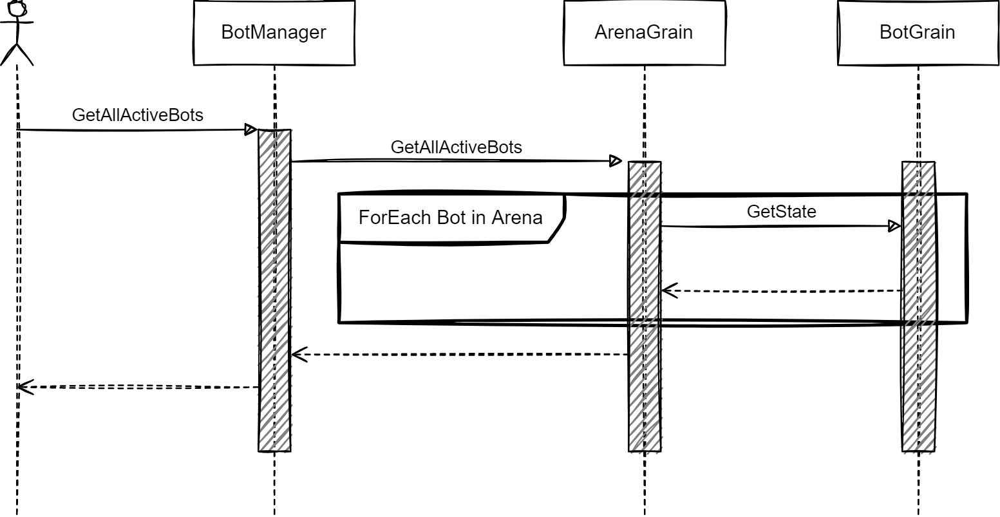

# CSharpWars-Orleans
Rewrite for the CSharpWars back-end using Microsoft Orleans

## Local development with Aspire

Run the complete local application from the repository root:

```powershell
dotnet run --project .\CSharpWars\CSharpWars.AppHost
```

The Aspire dashboard starts the web application, Web API, Orleans host, and Orleans validation host. Local-only environment variables are defined in the AppHost, including localhost Orleans clustering and in-memory grain storage. When `USE_ASPIRE` is not set, the existing Azure Storage and Kubernetes production configuration remains active.

# Sequence Diagramms

## GetAllActiveBots

.

